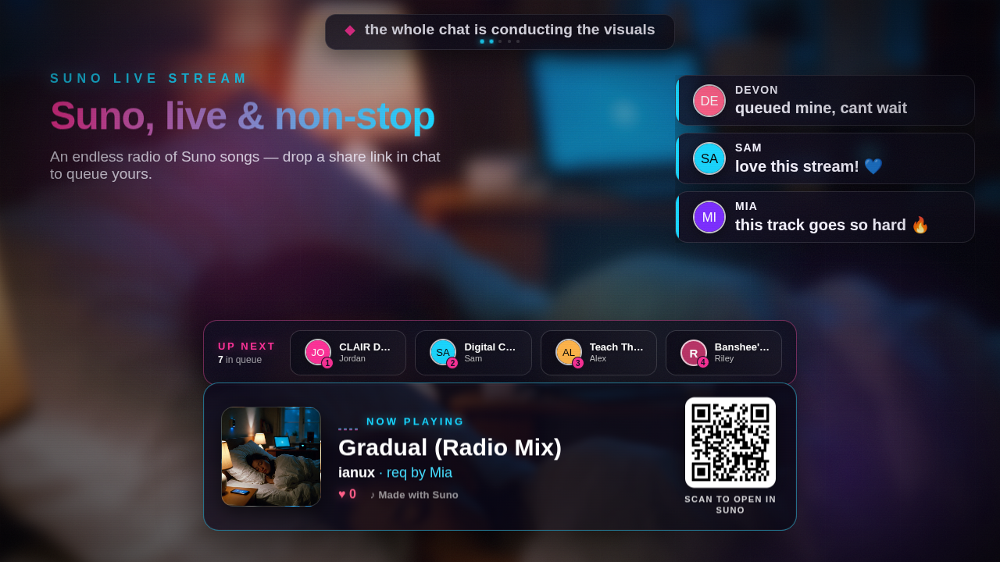

# SunoLiveStream

A 24/7 **live YouTube channel where viewers request AI-generated
[Suno](https://suno.com) songs and collectively steer the visuals** — every
moment captured so it's watchable later. Paste a Suno link in live chat; it
queues, plays, and the crowd's hearts, votes, and reactions drive a real-time
scene.

> Request a song. Heart it. Shape the room. All live.

Built on the **[HyperLive](https://github.com/imcmurray/hyperlive)** broadcast
engine (its upstream): a HyperFrames-style HTML/CSS/animation scene **streamed
live** instead of rendered offline. This repo is the Suno-focused product — see
**[`VISION.md`](VISION.md)** for the fork charter + roadmap, and HyperLive's
[`docs/platform-directions.md`](docs/platform-directions.md) for the reusable
kernel underneath.

[](https://suno.com)

## How it works

- A long-lived **HTML/CSS/GSAP scene** renders in a real headless browser and is
  captured live (CDP screencast / `x11grab` → ffmpeg) to **YouTube RTMP** — one
  continuous stream.
- An **auto-DJ** resolves viewer-requested Suno share links to playable audio,
  plays the request queue then a house rotation, with an intro-music loop under
  the standby screen.
- Moderated chat becomes **scene directives** (`{action, params}`) against an
  allow-list — viewer input is only ever *arguments* to pre-vetted actions, never
  markup or code.
- The crowd drives the atmosphere: per-song **hearts** (persist across replays),
  theme **votes**, a **Mood Engine**, instant **reactions**, **Super-Chat** tiers,
  and **stream-like milestones**.
- **Show flow**: intro → 10s on-air countdown → live; break / technical / outro
  screens with an artist **credit roll** + a Made-with-Suno rights line.

## Request a song (viewers)

In the **live-chat panel**, paste a Suno link — either form works:

```
https://suno.com/s/<id>        ← Share-button short link
https://suno.com/song/<uuid>   ← song-page URL
```

A ❤️ in chat likes the current song. Note: YouTube only lets **verified or
moderator** accounts post links in live chat.

## Quick start (operator)

```bash
cp ../hyperlive/.env .     # or: cp .env.example .env  and fill it in
scripts/live.sh build      # build + start the streamer container
scripts/live.sh start      # start the chat ingest (host process)
scripts/live.sh status     # health + now-playing + show phase
```

Live-ops: `scripts/live.sh {intro|onair [secs]|resume|tech|brb|outro|now|queue [url]|next}`
— full reference in **[`docs/live-ops.md`](docs/live-ops.md)**.

## Layout

```
packages/
  streamer/   scene + headless capture + ffmpeg→RTMP + /mutate + auto-DJ (src/music/)
  ingest/     YouTube live-chat poll + moderation + director + music requests + votes
  dashboard/  operator console + kill switch (planned)
scripts/live.sh   one tool to run the whole show
VISION.md         product charter + roadmap
docs/             phase notes, live-ops, platform-directions
```

## Operational truths (don't relearn these the hard way)

- **Post in the live-chat panel**, not the video's comments — only live chat feeds
  the API. Viewer links need **verified/moderator** status.
- **`live.sh build` = container/streamer; `live.sh restart` = host ingest** — two
  processes; a code fix won't take until the *right* one restarts.
- This iGPU's H264 encoder is **CQP-only** → use CPU libx264 **CBR**
  (`HW_ENCODE=false`) for a guaranteed bitrate ("excellent" stream quality).

## Relationship to HyperLive

`hyperlive` is wired as the **`upstream`** remote. Pull core/platform fixes down;
keep the Suno layer thin so merges stay clean:

```bash
git fetch upstream && git merge upstream/main
```

## Credits

SunoLiveStream is the Suno-focused fork of
**[HyperLive](https://github.com/imcmurray/hyperlive)**, which was itself
bootstrapped from **[HyperFrames](https://github.com/heygen-com/hyperframes)** by
[HeyGen](https://github.com/heygen-com) — an open-source, agent-friendly
framework for turning HTML + CSS + animations into deterministic MP4 videos.

Songs are created on **Suno** by their artists, who retain the rights to their own
work — played here with thanks. ❤️

---

License: Apache-2.0 (matching upstream HyperFrames / HyperLive).
