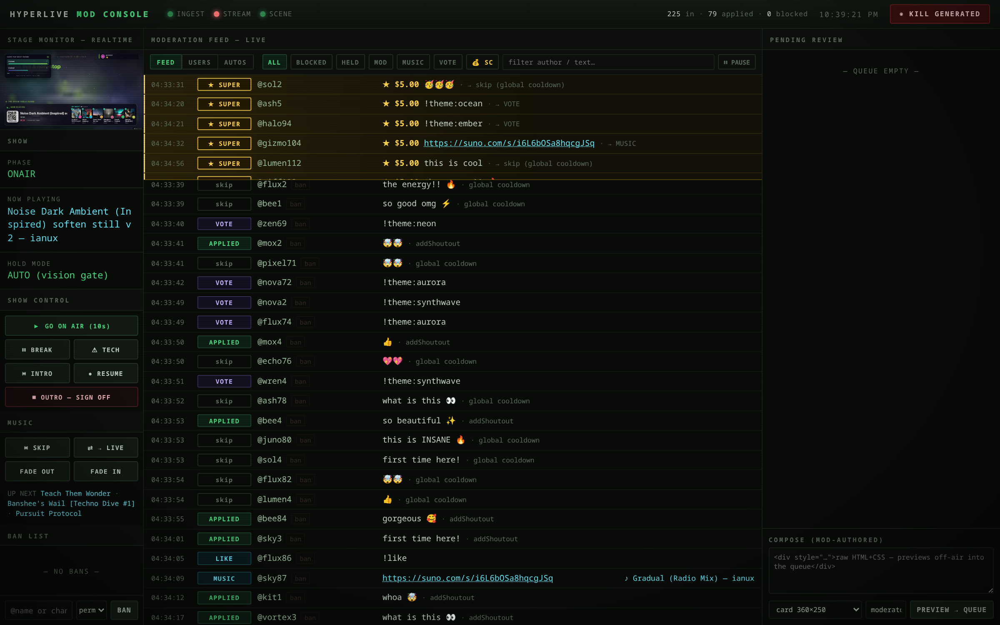

# dashboard (Phase 4 — the mod console)

Single-file moderator/operator console (`index.html`), served by the **ingest**
process at `http://127.0.0.1:8090/` (`ADMIN_PORT`). Loopback only by design —
no auth code to get wrong; remote mods tunnel in over SSH/Tailscale. The admin
API lives in `packages/ingest/src/admin.js`.

- **Live moderation feed** — SSE off an in-process ring buffer (replay + live),
  comment → decision → directive → applied, filterable by stage.
- **Kill switch** — clear all generated content from the stage in one click.
- **Bans / mutes / timeouts** + a **users directory** with per-user history.
- **Hold queue** — `HOLD_CARDS=on` parks viewer cards for human approval.
- **Show + music transport** — on-air countdown, break/tech/outro, skip, fade.
- **Live MJPEG monitors** — program feed + the off-air preview twin, proxied
  through :8090 so tunneled mods need only one port.
- **AUTOMATIONS view** — builtin + custom event→animation bindings, rehearsed
  against the preview twin before air.
- **Super-Chat callout tray** — paid messages pin in gold until the host clicks
  ★; the queue is server-side and shared between mods.
- Manual override: compose a card/takeover, replay a skipped comment, post any
  directive.
